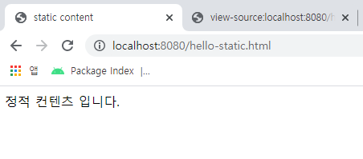
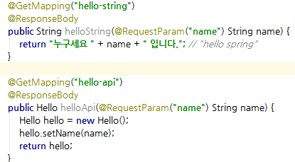

> 자바 스프링 입문 차 인프런 김영한님의 **무료 강의**를 보며 정리한 내용입니다.

## 스프링 웹 개발 기초

### 정적 컨텐츠

- 서버에서 파일을 그대로 웹 브라우저에 내려준다.

- src/main/resources/static/hello-static.html 만든 후 web browser에서 localhost:8080/hello-static.html 접속

  

- 웹브라우저 요청 ---> 스프링부트 내장 톰켓 서버 ---> 스프링 컨테이너 ---> resources 탐색 ---> 클라이언트로 반환

  

### MVC, 템플릿 엔진

- HTML을 동적으로 바꿔서 내려준다. (템플릿 엔진)
- Model, View, Controller 패턴을 주로 사용
- View : 화면과 관련된 일만
- Controller나 다른 비즈니스로직에서 데이터 처리작업 후 Model이 담아서 화면에 넘겨준다.
- HTTP GET방식 url입력 : {url}{?paramName=name}
- 웹브라우저 요청 (localhost:8080/hello-mvc) ---> 내장 톰켓 서버 ---> 스프링 부트
  ---> 스프링 컨테이너 helloController
         return: hello-template, model(name:spring)---> 스프링 부트
  ---> 스프링컨 컨테이너 viewResolver
         templates/hello-template.html (Thymleaf 엔진이 HTML변환)
  ---> 웹브라우저

### API

- API방식 : XML, JSON 등의 데이터를 클라이언트로 전달하는 방식
- MVC방식 : 템플릿엔진을 통해 화면 렌더링 후 HTML을 내려주는 방식
- 서버끼리 통신할 때 API 방식을 사용

- 크게 HTML, API 로 보면 된다. (HTML에 정적 컨텐츠 포함)

- 웹브라우저 요청 ---> 내장 톰켓 서버 ---> 스프링 부트
  ---> helloController
        @ResponseBody return
  ---> HttpMessageConverter (ResponseBody annotation이 있으면 Http컨버터 동작)
        문자 : StringConverter, 객체 : JsonConverter
  ---> 웹브라우저

- @ResponseBody 사용

  - HTTP의 BODY에 문자 내용을 직접 반환

  - viewResolver 대신 HttpMessageConverter 동작

  - 문자 -> StringHttpMessageConverter, 객체 -> MappingJackson2HttpMessageConverter

  - byte 및 기타 처리는 HttpMessageConverter가 기본

    

  

