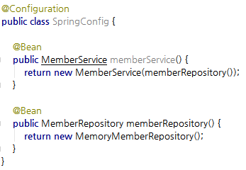
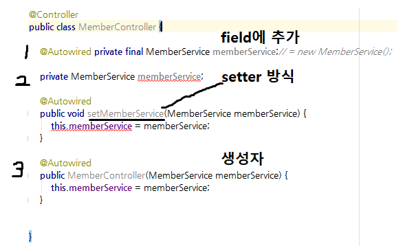

> 자바 스프링 입문 차 인프런 김영한님의 **무료강의**를 보며 정리한 내용입니다.


## 스프링 빈과 의존관계


### 컴포넌트 스캔과 자동 의존관계 설정


#### 스프링 빈을 등록하는 2가지 방법

- 컴포넌트 스캔과 자동 의존관계 설정 (Annotation직접 추가)
- 자바 코드로 직접 스프링 빈 등록하기


#### 의존관계 설정

- 멤버 서비스, 리포지토리를 통한 회원가입과 리포지토리 저장, 테스트 생성

- 화면에 데이터를 표시하려면 Controller, ViewTemplate이 필요

  -> 데이터에 접근해서 가져오고 화면을 만들어서 HTML로 반환하는 작업

- 멤버 컨트롤러가 멤버 서비스를 통해 데이터 조작 하는 것을 의존하는 관계라고 한다.

- @Controller Annotation이 있는 클래스는 스프링 생성 시 컨테이너에 만들어진다.(객체생성)

  Spring 컨테이너에서 Spring Bean이 관리된다고 표현한다.

  (실제로는 Component, Controller안에 @Component가 들어 있음)

  

- 클래스 생성자를 만들어 @Autowired Annotation을 추가

  ```java
  @Controller
  public class MemberController {
  
      private final MemberService memberService;
  
      // Container에서 찾아 자동으로 연결하겠다는 의미
      // 서비스 또한 Container에 등록해두어야 찾을 수 있다
      @Autowired // MemberController에서는 MemberService를 주입 받아야함
      public MemberController(MemberService memberService) {
          this.memberService = memberService;
      }
  }
  ```

  

- 연결될 클래스에 @Service Annotation을 추가 (실제로는 Component, Service안에 @Component가 들어 있음)

- 리포지토리에는 @Repository Annotation 추가 (실제로는 Component, Repository안에 @Component가 들어 있음)

  ```java
  // Annotation이 없으면 일반 클래스여서 스프링에서 확인 불가능하다
  @Service
  public class MemberService {
  
      private final MemberRepository memberRepository;
  
      @Autowired // MemberService에서는 MemberRepository를 주입 받아야함
      public MemberService(MemberRepository memberRepository) {
          this.memberRepository = memberRepository;
      }
  
  // MemberService에서 사용하는 repository에도 Annotation 붙여줌
  @Repository
  public class MemoryMemberRepositoryTest {
      MemoryMemberRepository repository = new MemoryMemberRepository();
  ```

  

- @Controller가 스프링 빈으로 자동 등록된 이유는 컴포넌트 스캔 때문이다.

- @Component를 포함하는 Annotation은 스프링 빈으로 자동 등록된다.

  @Controller

  @Service

  @Repository

- 기본적으로 컴포넌트 스캔의 대상은 실행하고자 하는 패키지 및 하위 패키지

  (main 함수가 있는 패키지 하위로만 컴포넌트 스캔을 해서 스프링 빈 등록함)

- 스프링 빈 등록 : helloController ---> memberService ---> memberRepository

  스플링 빈 등록 이미지 (의존관계들...)

  


#### 참고

> 스프링은 스프링 컨테이너에 스프링 빈을 등록할 때 기본 싱글톤으로 등록한다. 유일하게 하나만 등록해서 공유한다. 같은 스프링 빈 -> 같은 인스턴스
>
> 등록 디자인패턴은 설정에 따라 바꿀 수 있다.


---


### 자바 코드로 직접 스프링 빈 등록하기



- Config 클래스를 만들어서 Bean에 직접 등록해준다.
- Controller의 Annotation표시는 그대로 (Autowire 까지)
- Service와 Repository를 Bean등록
- Service에는 Repository Bean을 주입해주는 코드까지 작성


---

### Dependancy Injection

1. field에 추가

2. setter 방식 (setter가 public으로 열려있어야 한다.)

   -> setter가 public하게 열려있어 임의 시점에 접근 가능하다는 단점이 있음..

3. 생성자로 추가하는 방식



- 의존관계가 실행중에 동적으로 변하는 경우는 거의(아예) 없으므로 생성자 주입을 권장
- 정형화된 컨트롤러, 서비스, 리포지토리와 같은 코드는 컴포넌트 스캔 사용
- 정형화되지 않거나 **상황에 따라 구현 클래스를 변경**해야하면 설정을 통해 스프링 빈으로 등록한다
- @Autowire를 통한 DI는 스프링이 관리하는 객체에서만 동작. 스프링빈으로 등록하지 않은 객체에서는 동작하지 않음.


---


### 기타

#### static

- JVM의 static 메모리에 올라간다.
- static 메모리는 프로그램이 시작하고 종료될 때 까지 없어지지 않는다.
- 초기화 과정 필요 없이 static이 선언된 변수, 메소드에 바로 접근이 가능하다.

- 해당 객체를 공유하겠다는 의미로, 여기저기서 사용해도 동일한 객체를 사용하게 된다.
- 해당 객체를 변경하게 되면 참조하는 모든 부분에서 동일한 변경이 발생하게 되므로 주의가 필요하다.


#### final

- 재할당할 수 없도록 만드는 것.
- 상속 또는 초기화 이후 다시 초기화 할 수 없다.


#### 단축키

- ctrl + p : argument들어갈 자리에 커서를 놓고 단축키를 누르면 뭐가 필요한지 보여줌


#### 빌드


- 정상 실행 : Tomcat 서버가 시작되었다는 걸로 알 수 있다.
